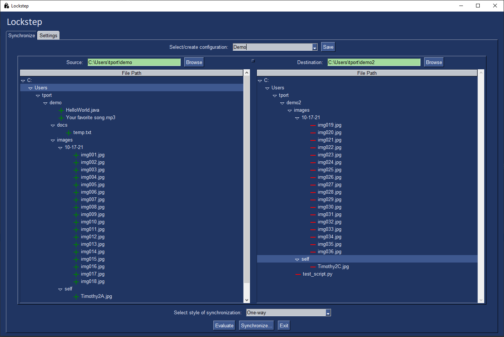

# Lockstep

*Lockstep* is a desktop application that enables user to synchronize files between source and destination folders. These configurations can be saved to the program's local data folder for later use.

## About

This program is written in [Python](https://www.python.org/). It makes use of libraries such as [PySimpleGUI](https://pysimplegui.readthedocs.io/en/latest/) and [dirsync](https://pypi.org/project/dirsync/).